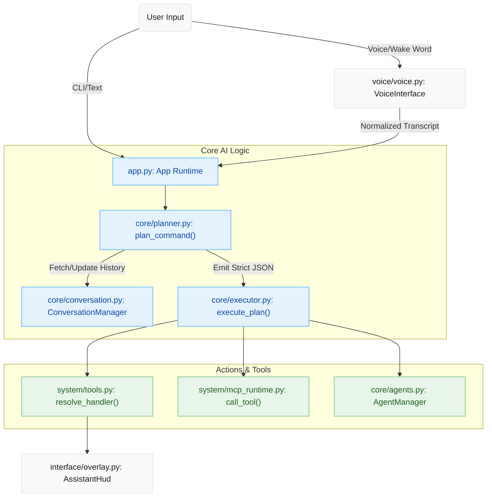

## 1. High-Level Summary (TL;DR)
*   **Impact:** High - This is an initial project creation introducing the entire codebase for **Jarvis**, a minimal, Windows-first local AI agent runtime.
*   **Key Changes:**
    *   **Core Architecture:** Implements a persistent system tray application (`app.py`) with a centralized tool execution engine (`core/executor.py`).
    *   **AI Planning:** Integrates an Ollama/Groq-backed natural language planner (`core/planner.py`) that outputs strict JSON steps for deterministic execution.
    *   **Voice Integration:** Adds a persistent voice-listening subsystem (`voice/voice.py`) utilizing `openwakeword` for wake detection and `faster-whisper` for local Speech-to-Text.
    *   **Extensibility:** Introduces a Model Context Protocol (MCP) runtime (`system/mcp_runtime.py`) to interface with standalone MCP servers and agents.
    *   **User Interface:** Provides a native Windows Tkinter tray Control Center (`interface/control_center.py`) and an on-screen Assistant HUD (`interface/overlay.py`).

## 2. Visual Overview (Code & Logic Map)
The following diagram illustrates the flow of a user command from input to execution within the new Jarvis architecture.

## 3. Detailed Change Analysis

### Application & Interface (`app.py`, `interface/`)
*   **What Changed:** Established the main application loop, global hotkeys, and system tray lifecycle management in `app.py`. Added Tkinter-based UI components: an overlay HUD for real-time visual feedback and a Control Center window for monitoring runtime health, memory, and logs.

### Core Logic & Planning (`core/`)
*   **What Changed:** 
    *   Implemented `planner.py` to route intents and generate actionable JSON plans using local LLMs.
    *   Added `executor.py` to safely run these plans, enforcing a risk-based confirmation system (`SAFE` vs `CONFIRM`) to prevent unwanted destructive actions.
    *   Created `conversation.py` to manage local, persistent conversation history and learned user preferences.

### System & Tooling (`system/`)
*   **What Changed:** Created a robust tool registry in `tools.py` for system, terminal, and browser actions. Introduced an MCP (Model Context Protocol) runtime in `mcp_runtime.py` that spawns and manages external tools as separate standard I/O server processes.

### Voice Subsystem (`voice/`)
*   **What Changed:** Built a continuous microphone listening loop using PyAudio. Added wake word detection using `openwakeword` and local speech transcription using `faster-whisper`. `transcript.py` handles text normalization before passing it to the planner.

### Dependencies & Configuration

| Package / Technology | Source | Description |
|---|---|---|
| `win10toast` | `requirements.txt` | Used for native Windows tray notifications. |
| `faster-whisper` | `README.md` | Handles local speech-to-text processing (`small.en` model). |
| `openwakeword` | `README.md` | Manages local wake word detection (`hey_jarvis` model). |
| `llama3.1:8b` | `README.md` | Recommended default local LLM (via Ollama) for planning. |

## 4. Impact & Risk Assessment
*   **Breaking Changes:** None. This is a brand new repository/project.
*   **Security & Risk:** ⚠️ **Medium Risk**. The application translates LLM outputs directly into executable local commands (`core/executor.py`). While a confirmation gate is implemented for risky operations, malicious prompt injection or hallucinated destructive system commands pose an inherent risk in local agent runtimes.
*   **Testing Suggestions:**
    *   **Voice Pipeline:** Verify microphone permissions, wake word trigger reliability, and STT accuracy in noisy environments.
    *   **Execution Guardrails:** Attempt a destructive command (e.g., "delete my documents folder") and ensure the `CONFIRM` prompt properly blocks execution until explicit user consent is granted.
    *   **LLM Fallback:** Test the application's behavior when the local Ollama instance is not running or takes too long to respond.
    *   **System Tray Lifecycle:** Verify that closing the tray application gracefully terminates all child MCP server processes and voice threads to prevent memory/CPU leaks.